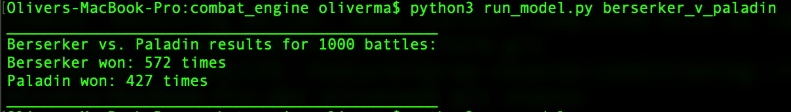

# Introduction

This simulator runs a 1v1 match up between classic character classes often
found in RPG and fighting games. Each 1v1 combat match is a "model" defined
by a YAML file. The model contains the stats of each character (i.e. paramaters)
which then are simulated a number of times.

The purpose of this simulator is to play-test different character stats in a
combat engine. The user is free to add more combat models via additional YAML
files with different parameters.

# Combat Engine

This is a simple simulation engine. There is no movement, the characters are
face-to-face fighting with a random chance of 50% for which character will land
a hit on the other. There are both standard attacks and critical hits.

There are no weapons or armour. There are two special abilities: "berserk"
which occurs when the character's health drops below some percentage causing
attack power to multiply and "prayer" which gains health consistently.

More special abilities can be added to the `Character` class as methods.

# Instructions

### Setup

There are very few requirements. Simply `git clone` and then:

```
cd combat-engine
pip install -r requirements.txt
```

### Combat Simulation

Create a new YAML file using `template.yaml` as a template. Input the model
name, parameters, and name the characters as you wish.

Please run for simulation:

```
python run_model.py <name-of-model-yaml>
```

Substitude `<name-of-model-yaml>` for the name of the YAML file you wish to
simulate. There is no need to include the `.yaml` file extension. Note that
`berserker_v_paladin.yaml` is available as an example of a well-tuned and
balanced combat simulation model.

Here is an example of a simulation output in the command line.



# Interpretation of the Results

Results where the the amount of matches won by both characters is close to
50% each, would demonstrate that the two character classes are close to equal
and therefore in a real life context, the game would then depend on the
individual skills of the players.

If the match is unbalanced with one "OP" (overpowered) character, it would
suggest a poorly designed or unbalanced character and require re-tuning of 
the character stats to ensure the game is balanced. Theoretically, a 
balanced game is a fun one!
